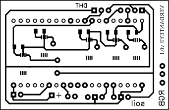
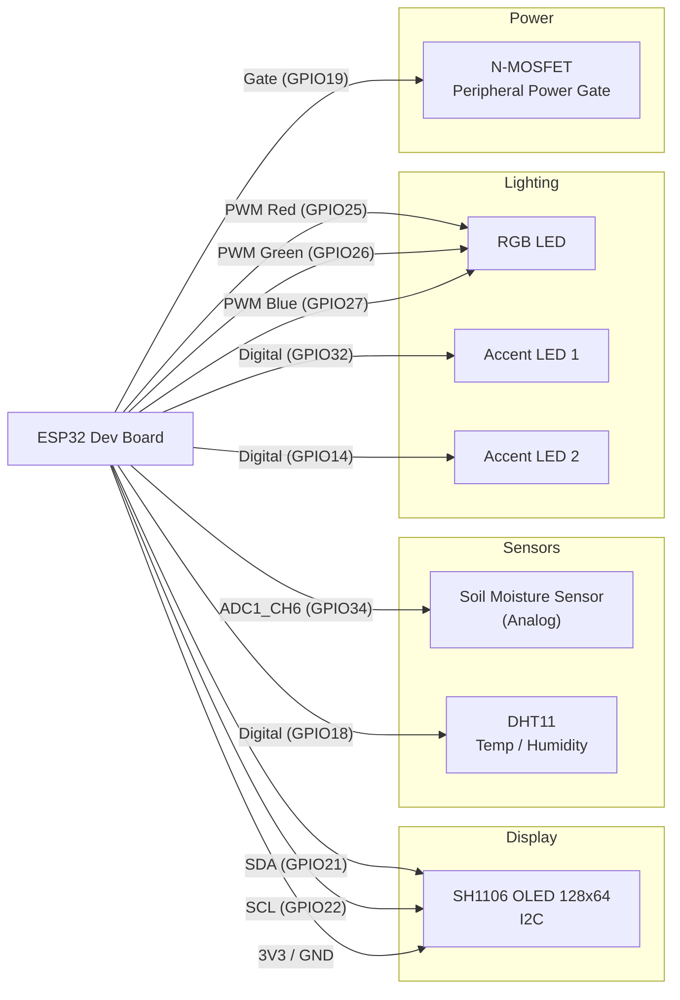

<div align="center">



# 🌱 VerdantEye — The Plant-Friendly Robot-Plant

**An ESP32-powered smart flower pot that monitors your plant, shows expressive robot eyes, and checks the weather.**


</div>

---

## 🪴 About VerdantEye

**VerdantEye** turns an ordinary flower pot into a small, expressive companion. An **ESP32** hidden inside the pot reads live soil moisture and ambient temperature/humidity, streams that data to the cloud over **Blynk**, and animates a pair of cartoon **robot eyes** on a mini OLED screen that blink, get curious, get tired, or get angry depending on the plant's mood and the moment. When it's bored, it can even pull the local weather forecast and display it instead.

No physical buttons, no companion app required for setup — the device boots into its own Wi-Fi access point the first time it's powered on, so you can configure your home network straight from your phone's browser.

## ✨ Features

| | |
|---|---|
| 🌡️ **Live Plant Telemetry** | Soil moisture (capacitive/resistive analog probe) + air temperature & humidity via DHT11 |
| 👀 **Expressive Robot Eyes** | Animated OLED "face" (FluxGarage RoboEyes) that cycles through idle, happy, tired, angry, and curious moods |
| ☁️ **Live Weather Page** | Pulls current conditions from OpenWeatherMap and displays them with custom pixel icons |
| 📲 **Blynk Dashboard** | Remote monitoring of soil/temp/humidity and remote control of onboard RGB + accent LEDs |
| 🎨 **RGB Mood Lighting** | PWM-driven RGB LED plus two auxiliary LEDs, all controllable from the Blynk app |
| 📡 **Captive Wi-Fi Setup** | First-boot access point + web form to save Wi-Fi credentials (no re-flashing needed) |
| 😴 **Deep Sleep Power Saving** | Automatically power-gates peripherals and deep-sleeps the ESP32 on a timer to save battery |

## 🧠 How It Works

VerdantEye's main firmware (`MODIFIED_FINAL_CODE`) runs a simple state machine:

```
BOOT → Try saved Wi-Fi → (fail) → AP Mode + Web Setup Portal → Save creds → Restart
                        → (success) → IDLE (roving robot eyes)
                                        ├─ every ~30s, roll a random mood → EMOTION mode
                                        ├─ occasionally → WEATHER mode (OLED shows forecast)
                                        └─ after ACTIVE_TIME_MINUTES → Deep Sleep (wakes after SLEEP_TIME_MINUTES)

In parallel: soil + DHT readings are averaged and pushed to Blynk every 30s,
             RGB/LED state is driven live from Blynk sliders/buttons.
```

## 🧰 Hardware / Bill of Materials

| Component | Purpose | Notes |
|---|---|---|
| ESP32 Dev Board | Main controller | WiFi + dual-core, drives everything |
| SH1106 OLED, 128×64, I²C | Robot eyes / weather display | Library: `Adafruit_SH110X` |
| Soil Moisture Sensor (analog) | Soil moisture % | Capacitive sensor recommended (less corrosion than resistive) |
| DHT11 Sensor | Air temperature & humidity | Swap for DHT22 in code if higher accuracy is needed |
| Common-Cathode RGB LED | Mood lighting | Driven via 3 PWM (LEDC) channels |
| 2× Single-color LEDs | Accent lights | Simple digital on/off from Blynk |
| N-Channel MOSFET | Power gating | Cuts power to peripherals during deep sleep |
| Li-ion battery + charge module (optional) | Portable power | Enables the deep-sleep power budget to matter |

## 🔌 Circuit Diagram & Wiring

> The only image shipped in this repository, **`VERDANT_EYE.png`**, is the project's eye-mascot logo (used as the README banner above) rather than a wiring schematic — so the diagram below is generated directly from the pin definitions in the firmware, to give you an accurate, up-to-date reference.



### Pinout reference

| ESP32 Pin | Connects To | Signal Type |
|---|---|---|
| `GPIO21` (SDA) | OLED display | I²C data |
| `GPIO22` (SCL) | OLED display | I²C clock |
| `GPIO34` | Soil moisture sensor (analog out) | Analog input (ADC1) |
| `GPIO18` | DHT11 data pin | Digital |
| `GPIO25` | RGB LED — Red | PWM (LEDC ch. 0) |
| `GPIO26` | RGB LED — Green | PWM (LEDC ch. 1) |
| `GPIO27` | RGB LED — Blue | PWM (LEDC ch. 2) |
| `GPIO32` | Accent LED 1 | Digital out |
| `GPIO14` | Accent LED 2 | Digital out |
| `GPIO19` | MOSFET gate (peripheral power switch) | Digital out |
| `3V3` / `GND` | OLED, sensors, LED commons | Power / Ground |

> ⚠️ **GPIO34 is input-only** on the ESP32 and works well for the analog soil probe. `GPIO18` and `GPIO19` are general-purpose and safe to use as shown. Always confirm your specific dev-board's pin silkscreen before wiring, since some ESP32 boards label pins differently.

## 📁 Repository Structure

The repo tracks the project's build history — from small single-feature test sketches up to the final integrated firmware.

| Folder | Description |
|---|---|
| **`MODIFIED_FINAL_CODE/`** | ⭐ **Main firmware** — integrates eyes, weather, sensors, RGB, Wi-Fi setup portal & deep sleep |
| `FULL_FINAL/`, `FULL_WIFI1/`, `FULL_WIFI_SLEEP/` | Earlier integration milestones leading up to the final build |
| `SOIL_DHT-MAIN/` | Soil + DHT11 sensor library (`VerdantEye.h/.cpp`) with Blynk reporting |
| `RGB_CONTROLLER-MAIN/` | RGB + accent LED driver library, Blynk-controlled |
| `API-MAIN/`, `API_WEATHER_STATION/`, `MODIFIED_WEATHER_STATION/` | OpenWeatherMap integration + OLED weather UI (`ESP32WeatherStation`) |
| `FINAL_API_CODE/` | Standalone weather-only display sketch with custom pixel-art icons |
| `HEART-MAIN/`, `CRYING-MAIN/`, `SLEEPING-MAIN/`, `HEART_ROBOT/`, `CRYING_ROBOT/`, `SLEEPING_ROBOT/` | Individual robot-eye mood/animation prototypes |
| `WEATHER_EMOTION/`, `DYNAMIC/` | Experiments blending weather state with eye mood |
| `SSID_PASSWORD/` | Standalone Wi-Fi provisioning portal (EEPROM-based prototype) |
| `AVG_SOIL_MOISTURE/`, `BLYNK_SOIL_HUMIDITY/` | Early soil sensor smoothing/averaging + Blynk test sketches |
| `RGB_CONTROLLER/`, `FINAL_EYES/` | Standalone RGB and eye-animation test sketches |
| `libraries/` | Bundled third-party & local Arduino libraries required to compile |
| `VERDANT_EYE.png` | Project logo / mascot artwork |

## 🛠️ Getting Started

### 1. Hardware setup
Wire the components as described in the [Circuit Diagram & Wiring](#-circuit-diagram--wiring) section above.

### 2. Install the Arduino environment
- Install the [Arduino IDE](https://www.arduino.cc/en/software) (or PlatformIO)
- Add ESP32 board support via the Boards Manager
- Copy everything inside `libraries/` into your Arduino `libraries/` folder (or open the sketch with this repo's `libraries/` folder already alongside it)

### 3. Configure your credentials
Open `MODIFIED_FINAL_CODE/MODIFIED_FINAL_CODE.ino` and `SOIL_DHT-MAIN/VerdantEye.h` and replace the placeholders for:
- Blynk template ID / auth token (`BLYNK_TEMPLATE_ID`, `BLYNK_AUTH_TOKEN`) — generate your own in the [Blynk console](https://blynk.cloud)
- OpenWeatherMap API key (`API_KEY`) — get a free key at [openweathermap.org](https://openweathermap.org/api)
- City / country for the weather page

> 🔐 **Security tip:** this codebase currently has Wi-Fi/API/Blynk credentials hardcoded directly in the source. Before publishing or sharing your build, move these into a local, git-ignored `secrets.h` file and swap in your own values — never commit real credentials to a public repo.

### 4. Flash the ESP32
Select your ESP32 board + correct COM port in the Arduino IDE, then upload `MODIFIED_FINAL_CODE.ino`.

### 5. First boot
- On first power-up (or if no saved Wi-Fi is found), the device starts an access point named **`VerdantEye_Setup`**
- Connect to it from your phone, open the captive setup page, and enter your home Wi-Fi credentials
- The device restarts, connects, and boots straight into its idle animated-eyes mode

### 6. Set up Blynk
Create a Blynk template with virtual pins matching the firmware:

| Virtual Pin | Function |
|---|---|
| `V0` | Soil moisture (%) |
| `V1` | Temperature (°C) |
| `V2` | Humidity (%) |
| `V3` | RGB — Red |
| `V4` | RGB — Green |
| `V5` | RGB — Blue |
| `V6` | Accent LED 1 |
| `V7` | Accent LED 2 |

## 🗺️ Roadmap

- [ ] Move all secrets into a `secrets.h` template + `.gitignore`
- [ ] Automatic watering trigger based on soil moisture threshold
- [ ] Battery level reporting to Blynk
- [ ] Consolidate prototype folders into a single clean `firmware/` + `archive/` split
- [ ] 3D-printable enclosure files

## 🤝 Contributing

This is currently a solo hobby/portfolio build. Issues and suggestions are welcome — feel free to open an issue or fork the repo.

## 📄 License

Not yet specified — consider adding an [MIT License](https://choosealicense.com/licenses/mit/) if you intend for others to reuse this project.

---

<div align="center">
<sub>Built with 🌱 by <a href="https://github.com/pratik252004-proton">pratik252004-proton</a></sub>
</div>
